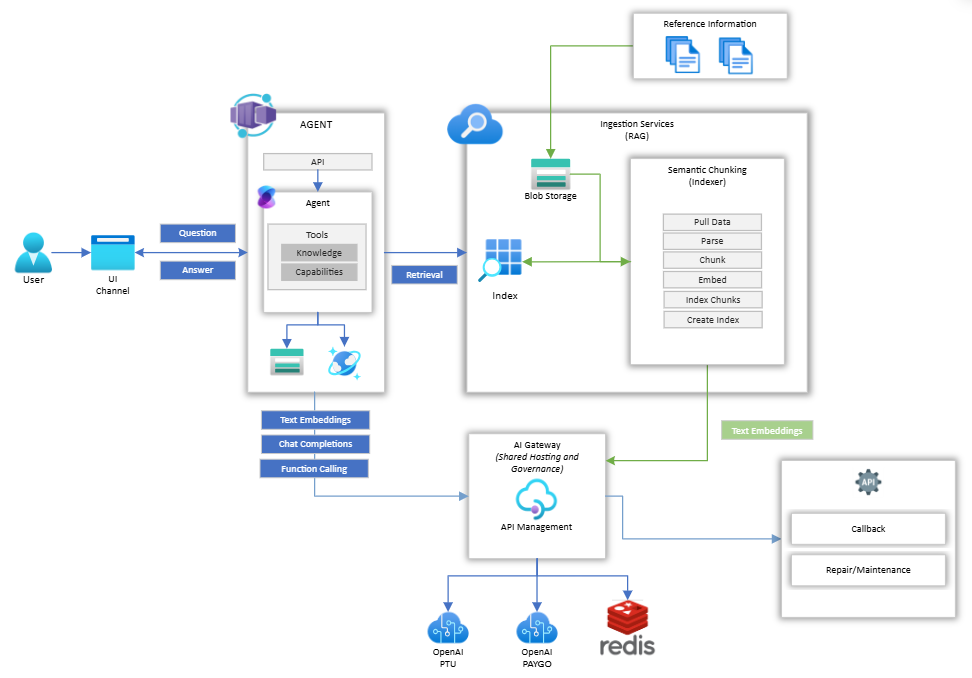
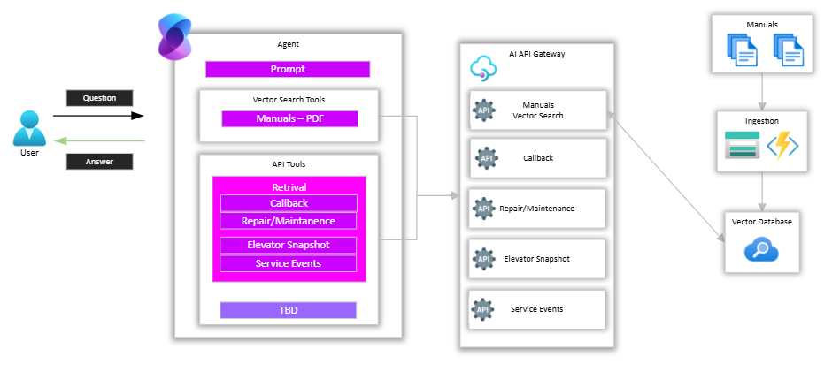
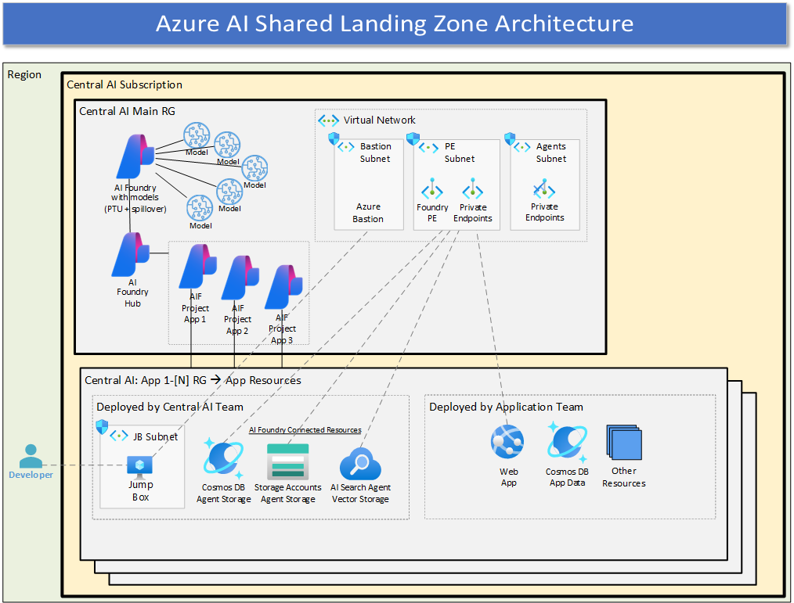

# Azure OpenAI Landing Zone Repo

This reference implementation deploys an AI Landing Zone for Azure OpenAI, which enables the deployment of agents in that environment.

## Azure Resource High Level Diagram

## Agent Architecture Diagram

## Agent Design Diagram

## Application Shared Landing Zone

---

## GitHub Workflows

[GitHub Actions Setup Instructions](.github/setup.md)

---

## Additional Documentation

TBD - coming soon...!

---

## Contributions

Please see our [Contributor guide](./CONTRIBUTING.md).

This project has adopted the [Microsoft Open Source Code of Conduct](https://opensource.microsoft.com/codeofconduct/). For more information see the [Code of Conduct FAQ](https://opensource.microsoft.com/codeofconduct/faq/) or contact <opencode@microsoft.com> with any additional questions or comments.

With :heart: from Azure Patterns & Practices, [Azure Architecture Center](https://azure.com/architecture).
