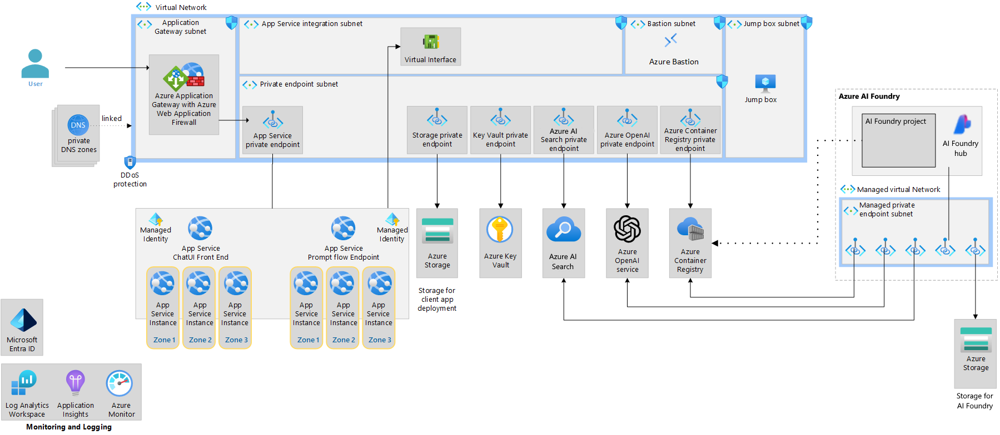

# Azure OpenAI Landing Zone Repo

This reference implementation deploys an AI Landing Zone for Azure OpenAI, which enables the deployment of agents in that environment.

## Azure Resource High Level Diagram

## Agent Architecture Diagram

## Agent Design Diagram

---

## GitHub Workflows

[GitHub Actions Setup Instructions](.github/workflows/README.md)

---

## Additional Documentation

TBD - coming soon...!
